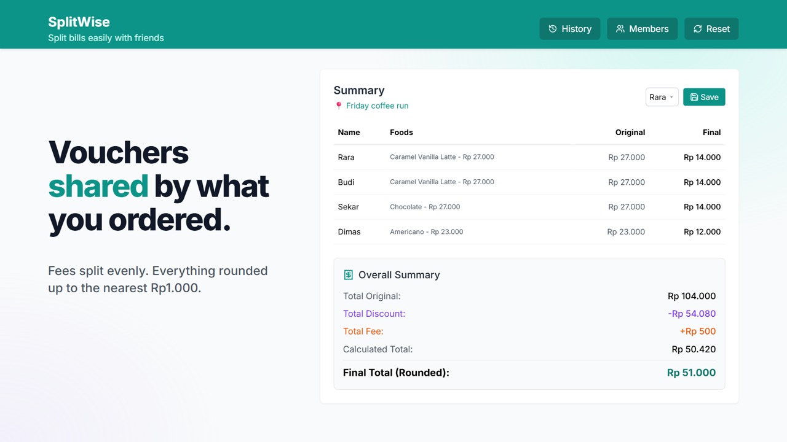

# Splitwise

**Split restaurant and food-delivery bills from a screenshot.**

Paid for the group order? Drop in the Shopee order screenshot. Splitwise reads every name, item, voucher and fee, works out what each person owes, and gives you a link to track who has paid.



## Features

- **Import from screenshot**: OCR runs in the browser with [Tesseract.js](https://github.com/naptha/tesseract.js), so no image leaves the device. It reads Shopee order-detail screenshots in the Indonesian or English UI. For long orders, add several screenshots in scroll order and the overlapping items are merged.
- **Fair splits**: split per item or equally. Discounts are shared in proportion to what each person ordered, fees are split equally, and each person's amount rounds up to the nearest Rp1.000.
- **Members**: keep a list of the people you split with, including their Shopee/Gojek/Grab usernames, so imported orders are matched to the right person automatically.
- **Save & share**: pick who paid, save the order, and a shareable link is copied to your clipboard.
- **Settlement tracking**: tick each person off as paid on the order page.
- **History and export**: browse past orders and export bills to PDF or CSV.

## Quick start

You need [Node.js](https://nodejs.org/) 18+ and a free [Supabase](https://supabase.com/) project.

```bash
git clone https://github.com/Tamlica/splitwise.git
cd splitwise
npm install
cp .env.example .env   # then fill in your Supabase URL and anon key
```

Apply the database schema by running the SQL files in [`supabase/migrations/`](supabase/migrations) in order. You can paste them into the Supabase SQL editor or use the [Supabase CLI](https://supabase.com/docs/guides/cli) (`supabase db push`).

```bash
npm run dev
```

Open http://localhost:5173, add your group on the **Members** page, and start splitting.

### Configuration

| Variable | Description |
|---|---|
| `VITE_SUPABASE_URL` | Your Supabase project URL |
| `VITE_SUPABASE_ANON_KEY` | Your Supabase anon (public) key |

The app throws at startup if either variable is missing.

> [!WARNING]
> There is no authentication. The row-level security policies let anyone with the anon key read and write members and orders. Deploy it only for a group you trust, or add Supabase Auth and tighten the policies first.

## Scripts

| Command | Description |
|---|---|
| `npm run dev` | Start the Vite dev server |
| `npm run build` | Production build to `dist/` |
| `npm run preview` | Preview the production build |
| `npm run lint` | Run ESLint |

## Project structure

```
src/
├── App.tsx                  # routes and bill state
├── components/              # UI: calculator sections, Summary, import modal, pages
├── lib/supabase.ts          # Supabase client
└── utils/
    ├── calculations.ts      # discount/fee split logic
    ├── orderOperations.ts   # members, orders, settlement
    └── ocr/                 # screenshot import
        ├── runOcr.ts        # Tesseract worker, image prep, row grouping
        ├── parsers/         # one parser per delivery app (Shopee so far)
        ├── mergeOrders.ts   # combines multiple screenshots
        └── reconcile.ts     # checks the parsed totals add up
supabase/migrations/         # database schema
```

## Contributing

Contributions are welcome. Open an issue to discuss bigger changes first.

**Wanted: Gojek and Grab parsers.** Parsers are pluggable. To add one, write a single file in `src/utils/ocr/parsers/` that implements `OrderParser`, then register it in `PARSERS` in `src/utils/ocr/index.ts`. Build it against a real screenshot rather than guessing the layout, and make sure it handles a fragment of a long order (no heading, no summary).

Before opening a pull request, make sure these pass:

```bash
npm run lint
npx tsc --noEmit -p tsconfig.app.json
```

## Tech stack

[Vite](https://vitejs.dev/) · [React 18](https://react.dev/) · TypeScript · [Tailwind CSS](https://tailwindcss.com/) · [Supabase](https://supabase.com/) · [Tesseract.js](https://tesseract.projectnaptha.com/) · [lucide-react](https://lucide.dev/)

## License

[MIT](LICENSE)
